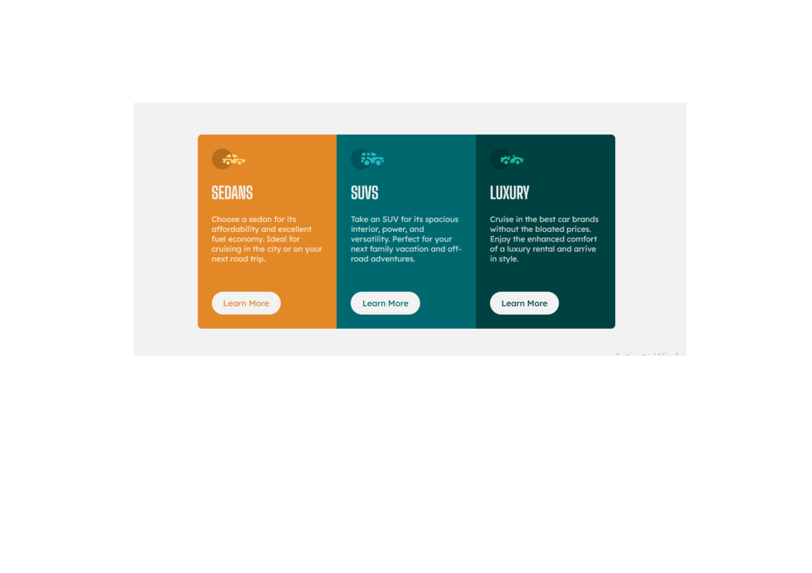

# Frontend Mentor - 3-column preview card component solution

This is a solution to the [3-column preview card component challenge on Frontend Mentor](https://www.frontendmentor.io/challenges/3column-preview-card-component-pH92eAR2-). Frontend Mentor challenges help you improve your coding skills by building realistic projects. 

## Table of contents

- [Overview](#overview)
  - [Screenshot](#screenshot)
  - [Links](#links)
- [My process](#my-process)
  - [Built with](#built-with)
  - [Useful resources](#useful-resources)
- [Author](#author)

## Overview
Good project for Beginner. focus on applying grid and flexbox according to device. 

### Screenshot

### Links

- Solution URL: [3-column-preview-card-component-main](https://www.frontendmentor.io/solutions/responsive-landing-page-using-css-flexbox-and-grid-NnxrfBUatY)
- Live Site URL: [3-column-preview-card-component-main](https://indian-goku.github.io/3-column-preview-card-component-main/)

## My process

### Built with

- Semantic HTML5 markup
- CSS custom properties
- Flexbox
- CSS Grid

### Useful resources

- [Chatgpt](https://www.chat.openai.com/) - This helped me for solving minor issues. 
- [W3schools](https://www.w3schools.com/) - This is an amazing article which helped me understand Grid. I'd recommend it to anyone still learning this concept.

## Author

- Coded by - [Chandan Kumar Singh]
- Frontend Mentor - [@Indian-goku](https://www.frontendmentor.io/profile/Indian-goku)
- Twitter - [@singhchandan98](https://twitter.com/singhchandan98)

